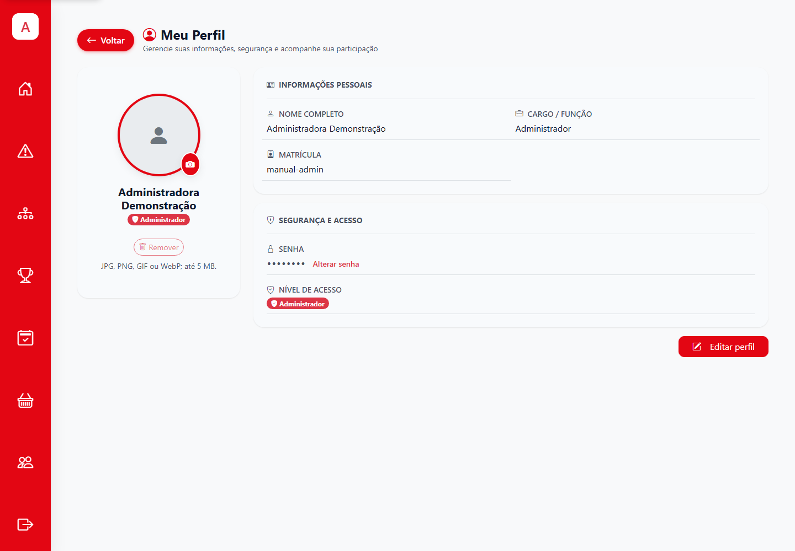

# 1. Acesso e conta

## 1. Entrar e sair

**Quem pode fazer:** todos os perfis com usuário ativo.  
**Antes de começar:** tenha sua matrícula/login e senha.  
**Onde:** página de entrada do SGI (`/login`).

1. Abra o endereço do SGI fornecido pela escola.
2. Informe sua matrícula/login e senha nos campos da tela.
3. Selecione **Entrar**.
4. Confira o destino: administração e colaboradores seguem para a área administrativa; mesários vão ao painel de operação; alunos seguem para a etapa de senha, termos ou início que estiver pendente.
5. Para encerrar o acesso, abra o menu e selecione **Sair**.

**Resultado esperado:** o painel correspondente ao seu perfil é exibido. A rota `/aluno/login` leva ao mesmo login; não é necessário criar outra conta ou outro endereço de autenticação.

**Se não der certo:** confira se matrícula e senha foram digitadas corretamente. Se o sistema informar acesso negado ou usuário inativo, solicite conferência ao administrador. A tela não oferece recuperação autônoma de senha para todos os perfis.

*Figura 1. A entrada é única; os recursos disponíveis depois do login dependem do perfil.*

### Permissões em resumo

- **Administrador:** prepara edições e usuários e gerencia a configuração administrativa.
- **Colaborador:** executa tarefas administrativas autorizadas para sua conta. Nem toda ação de administrador fica disponível.
- **Mesário:** trabalha com partidas da edição ativa; não administra edições.
- **Aluno:** acessa termos, início, inscrições, jogos e perfil.

O sistema valida a permissão ao executar cada ação. Se um botão ou endereço não estiver disponível, peça ao administrador para verificar o perfil e o escopo da edição.

## 2. Primeiro acesso do aluno

**Quem pode fazer:** aluno cadastrado na edição.  
**Antes de começar:** saiba sua matrícula e a senha inicial fornecida pela escola ou pelo administrador.

1. Entre pela página de login única usando a matrícula e a senha inicial.
2. Se o sistema abrir **Trocar senha**, defina sua senha pessoal e conclua a confirmação solicitada.
3. Leia os termos apresentados. Abra o regulamento quando houver um link e consulte-o antes de aceitar.
4. Selecione **Aceitar** somente depois de ler e concordar com as condições.
5. Acesse **Início** e confirme que aparece a edição correta.

**Resultado esperado:** depois da troca obrigatória de senha e do aceite dos termos, o menu do aluno libera **Início**, **Inscrições**, **Jogos**, **Perfil** e **Termos**.

**Se não der certo:** se o sistema voltar à troca de senha ou aos termos, conclua a etapa indicada. Se não reconhecer sua matrícula, peça ao administrador para conferir o cadastro na turma e na edição certas. A senha inicial deve ser trocada e não deve ser compartilhada.

## 3. Atualizar o perfil

**Quem pode fazer:** usuário autenticado, nos campos liberados para seu perfil.  
**Onde:** **Perfil** no menu.

1. Abra **Perfil** e confira se a conta exibida é a sua.
2. Altere apenas os campos que a tela permite editar.
3. Para trocar a foto, selecione uma imagem JPG, PNG, GIF ou WebP de até 5 MB.
4. Selecione **Salvar** e aguarde a confirmação. Para remover a foto, use a ação de remoção apresentada pela tela, se estiver disponível.

**Resultado esperado:** os dados atualizados aparecem ao voltar ao perfil ou reabrir o menu.

**Se não der certo:** verifique o formato e o tamanho do arquivo e tente novamente. Não envie foto de outra pessoa sem autorização.

*Figura 2. Os campos e as ações do perfil dependem do tipo de usuário.*

## 4. Senha esquecida ou acesso bloqueado

1. Não repita tentativas com senhas de outras pessoas.
2. Peça ao administrador da edição para verificar o cadastro ou redefinir a senha pelo recurso disponível na gestão de alunos/usuários.
3. No primeiro acesso após uma redefinição, siga a troca obrigatória de senha se o sistema solicitar.

**Importante:** a alteração de senha ou permissão pode encerrar sessões existentes. Entre novamente com suas credenciais atualizadas.

**Próximo passo:** [preparar a edição](02-administrador-edicao.md) ou [seguir a jornada do aluno](05-aluno.md).
