# 2. Administrador: preparar a edição

Este capítulo cobre a preparação administrativa. Faça a configuração antes de publicar o cronograma e abrir inscrições. Os nomes e valores de categorias, turmas e modalidades podem variar de uma instalação para outra.

## 1. Criar e escolher a edição

**Quem pode fazer:** administrador.  
**Onde:** menu administrativo → **Edições**.

1. Selecione **Criar Nova Edição**.
2. Informe o nome da edição e o ano.
3. Selecione **Criar** e aguarde a confirmação.
4. Confira a lista de edições e o estado ativo. Se houver mais de uma edição, selecione a que será configurada antes de abrir as demais telas.
5. Abra o **Painel** e confirme o nome/ano no cabeçalho antes de alterar dados.

**Resultado esperado:** a edição aparece na lista e pode ser aberta para configurar resumo, categorias, turmas, modalidades e demais recursos.

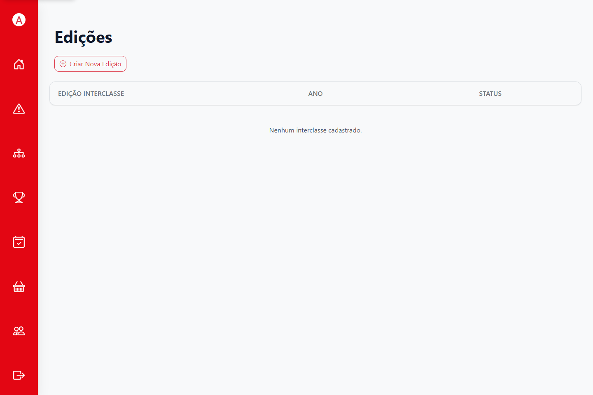

*Figura 1. Em uma instalação nova, a lista pode começar vazia.*

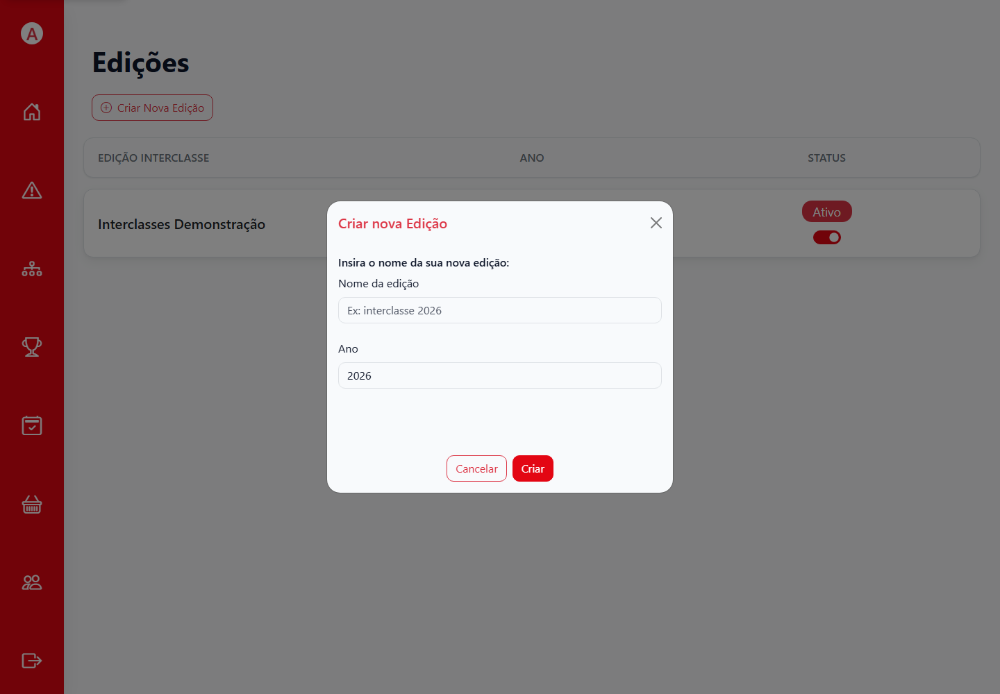

*Figura 2. O formulário pede nome e ano; confira a edição selecionada antes de prosseguir.*

## 2. Conferir o resumo e os dados iniciais

**Quem pode fazer:** administrador; colaboradores podem consultar ou alterar itens quando a permissão permitir.  
**Onde:** **Painel** → **Resumo da edição**.

1. Confira o nome e ano da edição no painel.
2. Abra **Resumo** e percorra as contagens de categorias, turmas, modalidades e configurações de pontuação.
3. Se a edição trouxe registros iniciais, confirme quais devem ser mantidos e ajuste antes de criar alunos ou inscrições.
4. Volte ao resumo após cada bloco de configuração para conferir o resultado.

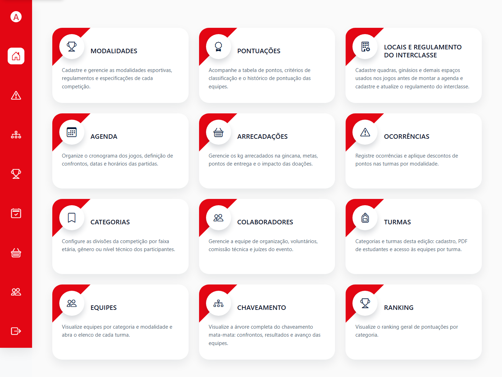

*Figura 3. O painel reúne atalhos e identifica a edição de trabalho.*

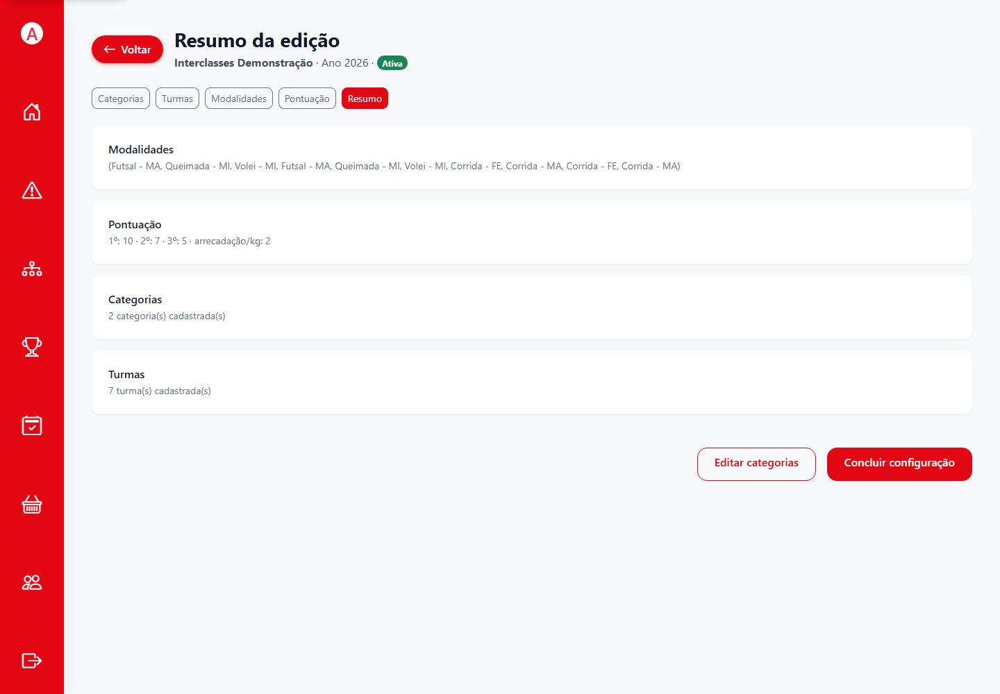

*Figura 4. Use o resumo como conferência, não como substituto dos cadastros detalhados.*

## 3. Configurar categorias e turmas

**Quem pode fazer:** administrador.  
**Onde:** **Categorias** e **Turmas**.

1. Em **Categorias**, confirme os grupos previstos para a edição. Crie ou edite cada categoria conforme a organização escolar.
2. Em **Turmas**, abra a categoria correspondente e confira os nomes das turmas vinculadas.
3. Crie ou ajuste uma turma somente depois de confirmar a categoria correta.
4. Ao terminar, volte à listagem e verifique se cada turma aparece na categoria esperada.

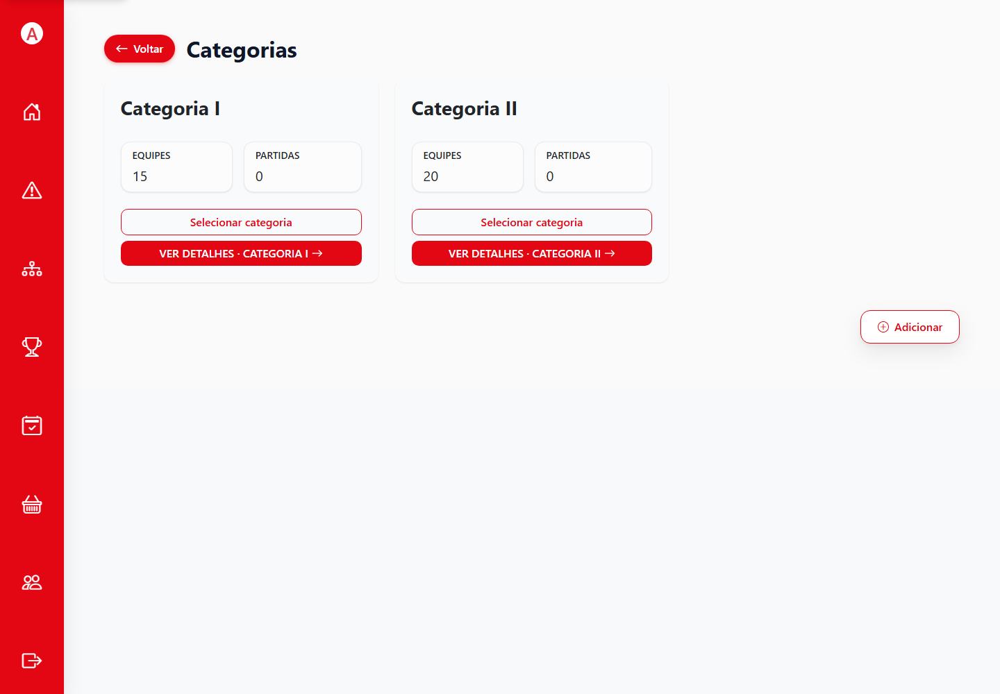

*Figura 5. As categorias organizam as turmas e os cadastros vinculados.*

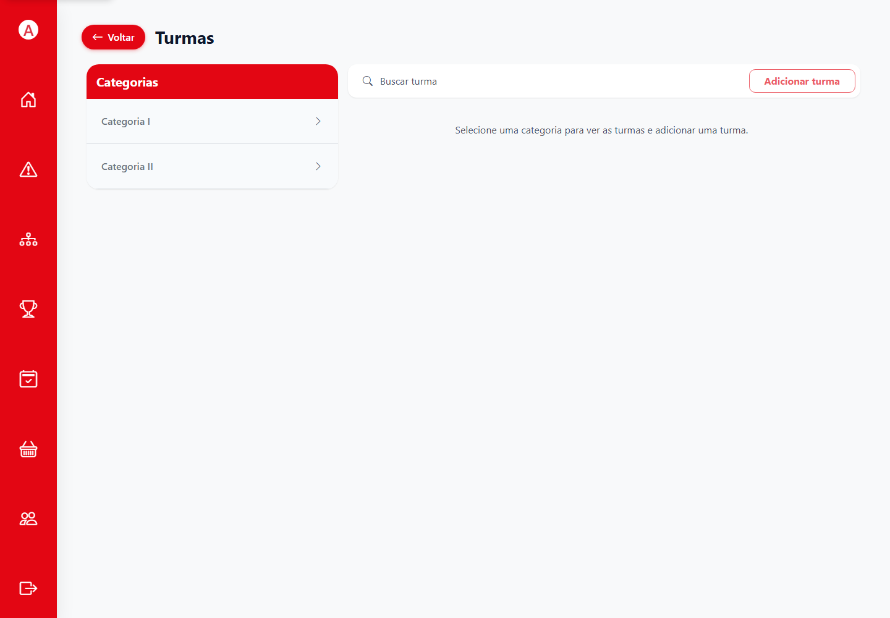

*Figura 6. Selecione uma categoria para consultar ou abrir suas turmas.*

**Se não der certo:** não crie uma turma duplicada para contornar um vínculo incorreto. Confira o contexto da edição e peça ao administrador principal para corrigir a categoria ou a turma.

## 4. Cadastrar e importar alunos

**Quem pode fazer:** administrador.  
**Onde:** **Turmas** → abra a turma → **Adicionar estudante** ou **Importar estudantes via PDF**.

### Cadastro individual

1. Abra a turma correta dentro da edição.
2. Selecione **Adicionar estudante**.
3. Informe nome completo, RM/matrícula, gênero e data de nascimento.
4. Confira os dados e selecione **Salvar**.
5. Pesquise o aluno na lista e confirme seu vínculo com a turma.

### Importação por PDF

1. Expanda **Importar estudantes via PDF**.
2. Escolha uma lista em PDF de até 10 MB. O conteúdo precisa ter texto selecionável; um PDF formado apenas por imagem pode não ser processado.
3. Revise o arquivo escolhido e selecione **Importar PDF**.
4. Aguarde o resultado, depois pesquise nomes/RMs na lista da turma e corrija divergências pelo cadastro individual.

**Resultado esperado:** cada aluno aparece na turma certa e pode acessar o SGI com a matrícula. Cadastros novos usam a senha inicial definida pelo sistema e exigem troca no primeiro acesso.

**Se não der certo:** confira se o PDF é selecionável, tem até 10 MB e corresponde à turma aberta. Não importe a mesma lista repetidamente sem conferir os cadastros existentes.

## 5. Configurar modalidades e equipes

**Quem pode fazer:** administrador.  
**Onde:** **Modalidades** → **Nova Modalidade** ou **Ver detalhes**.

1. Confira as modalidades já listadas antes de criar outra.
2. Para uma modalidade nova, informe nome, gênero, categoria, tipo e os limites exibidos.
3. Em **Planejamento antecipado**, informe **Equipes/entradas por turma** quando o cronograma será preparado antes das inscrições. Preencha também mínimo e máximo por equipe conforme a regra da modalidade.
4. Confira capacidade de inscritos e de equipes por turma. Um campo opcional sem limite pode representar capacidade ilimitada; valide a regra local antes de deixar sem limite.
5. Selecione **Criar** e confirme que a modalidade aparece sob a categoria esperada.
6. Abra **Equipes** e confira quantas equipes vazias foram planejadas para cada turma/modalidade.

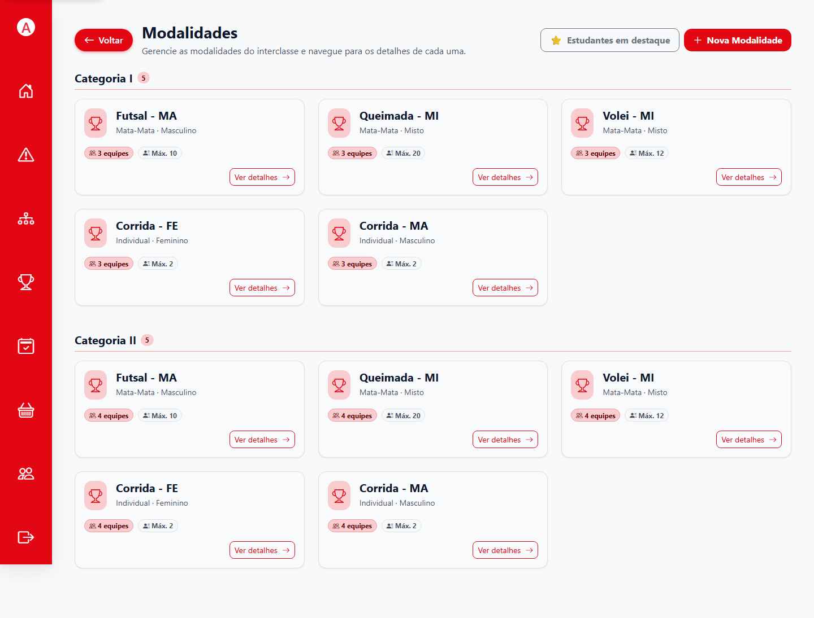

*Figura 7. Verifique primeiro o que já existe para evitar cadastros duplicados.*

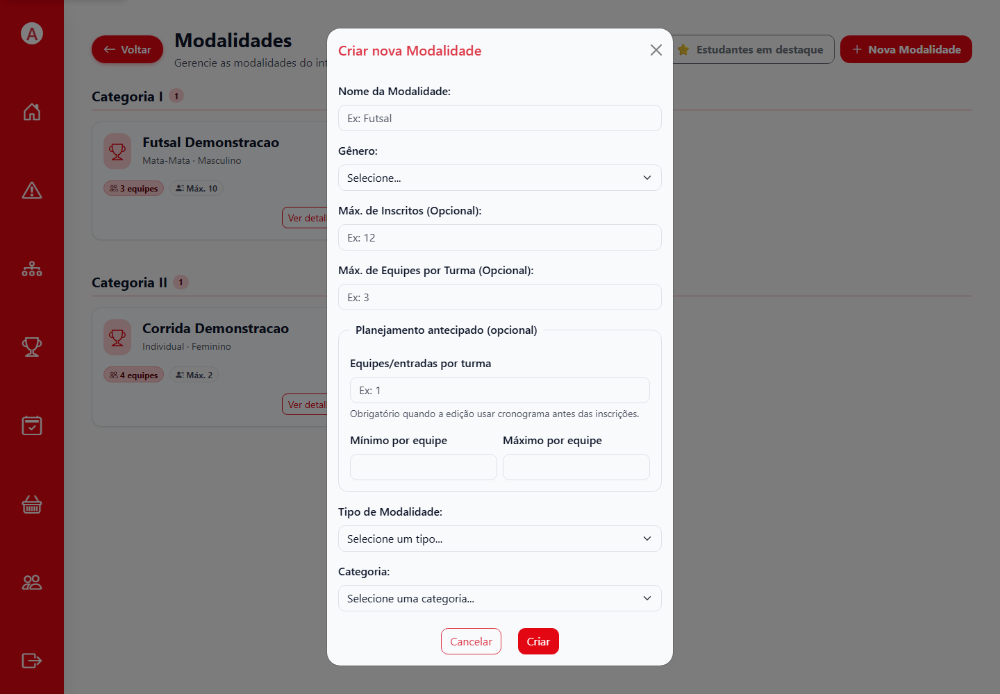

*Figura 8. Quando a agenda precede as inscrições, o campo de equipes/entradas por turma é necessário para planejar a grade.*

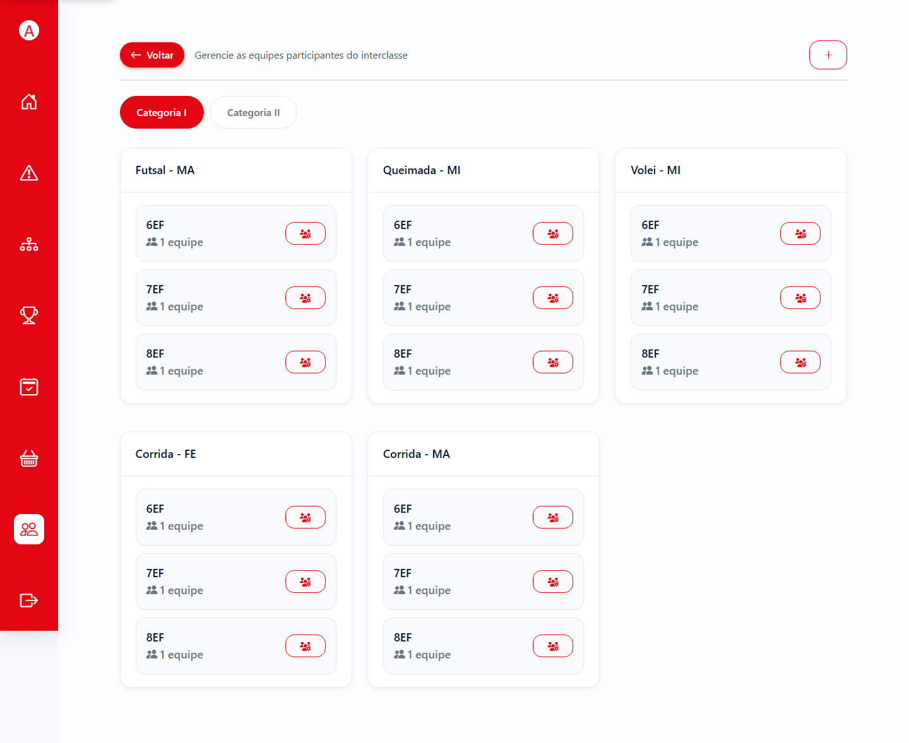

*Figura 9. Confira turma, modalidade e quantidade de equipes antes da janela de inscrição.*

### Atenção ao planejamento de modalidades existentes

Na tela de criação verificada, o planejamento de equipes aparece no formulário. A tela de edição de uma modalidade já existente pode não mostrar esse campo. Se a Agenda disser que faltam quantidades planejadas, confira cada modalidade ativa. Não exclua modalidades ou equipes com inscrições/resultados para contornar o bloqueio; peça ao administrador responsável para definir a correção adequada.

## 6. Cadastrar locais e regulamento

**Quem pode fazer:** administrador.  
**Onde:** **Locais / Regulamento**.

1. Confira os locais disponíveis e cadastre ou edite os espaços que podem receber os jogos.
2. Verifique se os locais estão identificados com nomes inequívocos e se estão disponíveis no período da edição.
3. Se a edição usar regulamento/termo, carregue o documento pela área correspondente e confirme que ele pode ser consultado.
4. Retorne à Agenda e confira os locais oferecidos na grade.

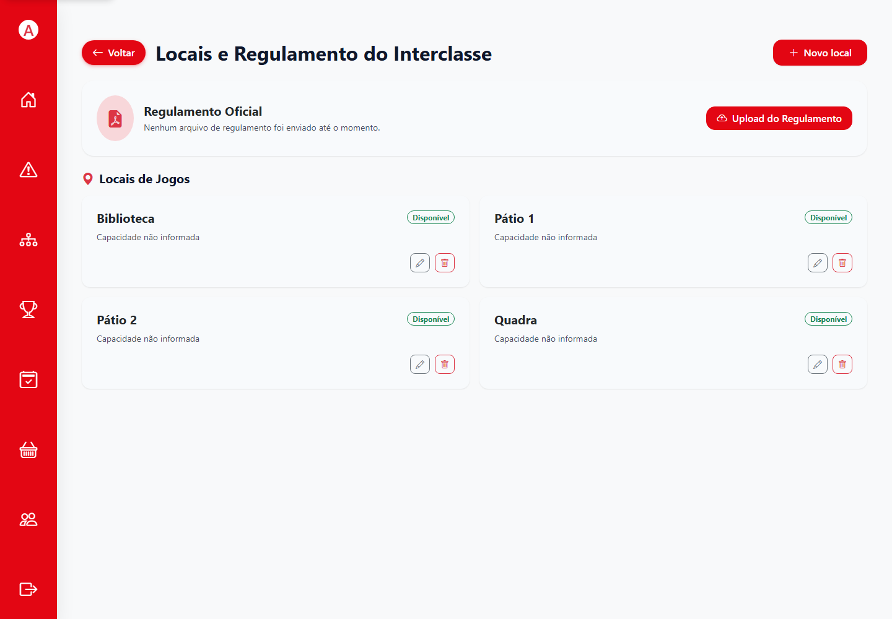

*Figura 10. A grade usa os locais cadastrados para distribuir as partidas.*

## 7. Configurar a pontuação

**Quem pode fazer:** administrador.  
**Onde:** **Pontuação**.

1. Abra as configurações e confira os valores de colocação e os fatores relacionados à arrecadação que a instalação apresenta.
2. Ajuste os valores conforme o regulamento aprovado para a edição.
3. Salve e volte à tela para conferir os valores persistidos.
4. Registre a regra adotada para que quem consulta o ranking saiba qual edição está usando.

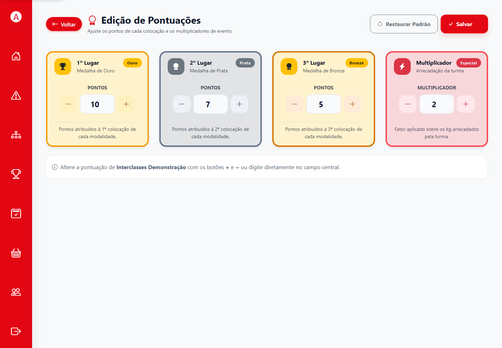

*Figura 11. Os valores mostrados são apenas os da edição fictícia capturada; configure os valores oficiais da sua edição.*

## 8. Gerenciar colaboradores e mesários

**Quem pode fazer:** administrador.  
**Onde:** **Colaboradores**.

1. Abra a gestão de usuários e confira se a pessoa já possui cadastro.
2. Crie ou edite o usuário com a identificação e o perfil apropriados.
3. Para operação de partidas, atribua o perfil de mesário; para apoio administrativo, escolha o perfil de colaborador conforme a responsabilidade.
4. Salve e peça à pessoa para entrar e confirmar que vê as telas compatíveis com a função.

Não compartilhe uma conta entre usuários. Alterar senha ou permissão invalida o acesso que ainda estiver usando uma sessão antiga; o usuário precisa entrar novamente.

## 9. Conferir antes de planejar

Antes de abrir a Agenda, use o resumo para revisar: edição ativa, categorias e turmas, alunos, modalidades/entradas planejadas, limites de elenco, locais, regulamento e pontuação. Corrija cadastros antes de gerar a grade.

**Próximo passo:** [gerar e publicar o cronograma](03-agenda-e-inscricoes.md).
