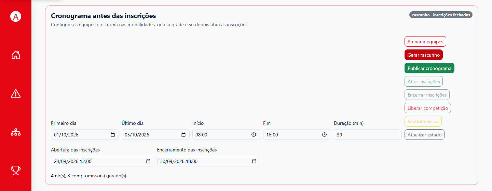
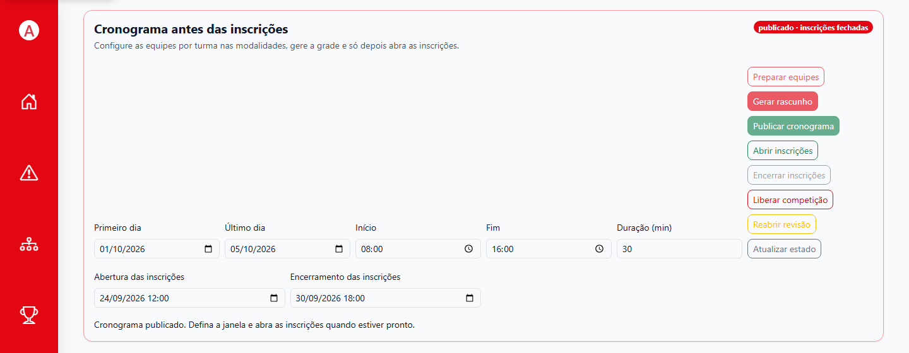
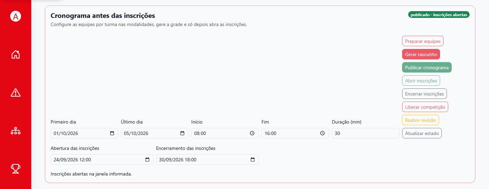
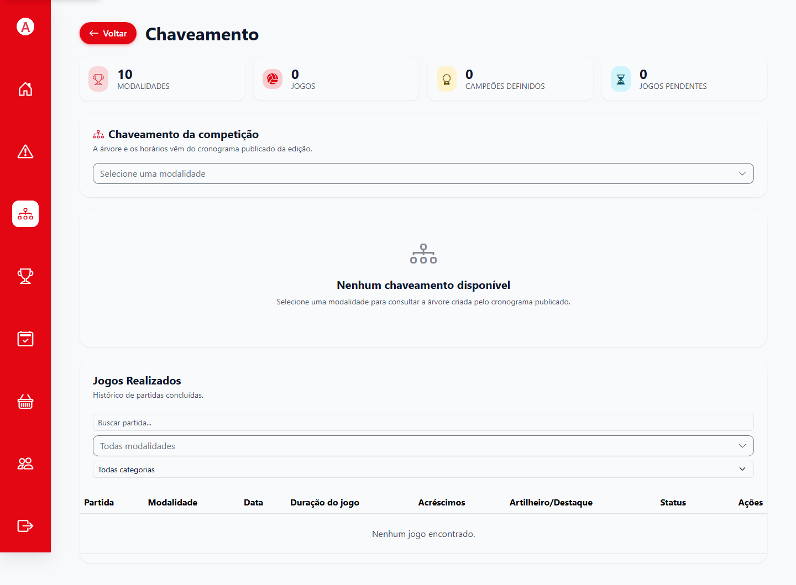

# 3. Agenda e inscrições

O cronograma precisa ser publicado antes da abertura das inscrições. A inscrição usa os confrontos previstos para verificar disponibilidade e conflitos. Leia a grade antes de publicar: liberar a competição cria os jogos iniciais a partir desse planejamento.

## 1. Preparar as equipes vazias

**Quem pode fazer:** administrador.  
**Antes de começar:** modalidades ativas, quantidades planejadas e limites de elenco conferidos.  
**Onde:** **Agenda** da edição.

1. Confira o nome da edição no topo.
2. Selecione **Preparar equipes**.
3. Aguarde a confirmação e abra **Equipes** para verificar modalidades, turmas e vagas criadas.
4. Se o sistema indicar modalidade sem quantidade planejada, retorne a **Modalidades** e confira a configuração antes de continuar.

**Resultado esperado:** há equipes/entradas correspondentes ao planejamento para receber as inscrições.

**Se não der certo:** a mensagem pode indicar uma modalidade ativa sem quantidade planejada. Não tente publicar uma grade parcial; corrija a configuração primeiro. Veja também [configurar modalidades](02-administrador-edicao.md#5-configurar-modalidades-e-equipes).

## 2. Informar período, horários e janela de inscrição

**Quem pode fazer:** administrador.  
**Onde:** painel **Cronograma antes das inscrições**.

1. Informe **Primeiro dia** e **Último dia** da competição.
2. Informe o horário de **Início**, o de **Fim** e a **Duração (min)** de cada partida.
3. Informe a **Abertura das inscrições** e o **Encerramento das inscrições**.
4. Confira se os períodos permitem realizar todos os confrontos nos locais disponíveis.
5. Selecione **Gerar rascunho**.

Os valores da Figura 12 são de demonstração. Use as datas, horários e a duração aprovados para sua edição.

*Figura 12. O rascunho é gerado a partir do período e dos horários informados.*

## 3. Revisar o rascunho

1. Leia a mensagem de geração e confira quantos nós/confrontos e compromissos foram criados.
2. Percorra as modalidades e datas no calendário. Use busca e filtros para localizar equipes, modalidades ou estados.
3. Abra os detalhes de cada compromisso e confira participantes, dia, hora e local.
4. Resolva todos os avisos/pendências na configuração de modalidades, equipes ou locais.
5. Ajuste o período ou a disponibilidade de locais e gere um novo rascunho, se necessário.

**Resultado esperado:** a prévia não contém pendências e os confrontos cabem no período e nos locais planejados.

**Atenção:** gerar rascunho não abre inscrições e não publica o cronograma. A grade continua sujeita a revisão.

## 4. Publicar e abrir as inscrições

**Quem pode fazer:** administrador.  
**Antes de começar:** revise o cronograma e a janela de inscrição.

1. Selecione **Publicar cronograma**.
2. Confira o estado apresentado: cronograma publicado, inscrições fechadas.
3. Quando estiver pronto para receber inscrições e a janela configurada estiver válida, selecione **Abrir inscrições**.
4. Confira a confirmação **Inscrições abertas na janela informada** e o estado exibido no painel.
5. Abra o calendário no mês do evento para confirmar que os compromissos publicados aparecem.

*Figura 13. Publicar a grade não abre automaticamente as inscrições.*

*Figura 14. A abertura é uma ação separada; confira o estado e a janela informada.*

## 5. Acompanhar as inscrições e encerrar a janela

1. Acompanhe as equipes e seus elencos nas telas de **Equipes** e de **Estudantes**.
2. Depois do prazo ou quando a organização definir o encerramento, selecione **Encerrar inscrições**.
3. Confira a lista de elencos e compare cada equipe com o mínimo/máximo configurado na modalidade.
4. Corrija equipes incompletas antes de liberar a competição, seguindo a regra da edição.

O sistema recusa situações incompatíveis, como conflito de horários entre modalidades, vagas esgotadas ou regras de gênero/categoria não atendidas. O aluno deve corrigir a escolha ou pedir ajuda à administração; não tente contornar a validação criando uma segunda inscrição.

## 6. Reabrir a revisão antes da liberação

Se a organização precisar ajustar a grade depois da publicação:

1. Encerre as inscrições, caso ainda estejam abertas.
2. Selecione **Reabrir revisão** enquanto a competição ainda não foi liberada.
3. Confira a mensagem de confirmação e a grade que volta ao estado de revisão.
4. Gere, revise e publique a grade corrigida; depois, abra novamente as inscrições se a janela continuar válida.

A revisão substitui compromissos da publicação suspensa e preserva reservas independentes. Confirme cada compromisso antes de publicar. Depois da liberação da competição, a árvore não pode ser substituída por uma nova revisão.

## 7. Liberar a competição

**Quem pode fazer:** administrador autorizado.  
**Antes de começar:** inscrições encerradas, elencos verificados e cronograma publicado.

1. Confira que cada equipe atingiu o mínimo de participantes e que não há cadastros ou horários a corrigir.
2. Na Agenda, selecione **Liberar competição**.
3. Leia a confirmação e prossiga somente quando estiver pronto para iniciar a etapa competitiva.
4. Abra **Jogos** e **Chaveamento** para confirmar que os jogos iniciais e a árvore estão disponíveis.

**Resultado esperado:** o sistema cria os jogos iniciais com base na árvore e nos horários publicados. Resultados concluídos avançam a próxima fase mantendo o cronograma.

**Importante:** a liberação é um marco de fluxo. Antes dela, use a revisão da Agenda para alterar a grade. Não tente recriar a chave por outra tela.

*Figura 15. A tela de Chaveamento consulta a árvore do cronograma publicado.*

**Próximo passo:** [operar os jogos](04-competicao-e-mesario.md) ou [orientar os alunos sobre inscrições](05-aluno.md).
