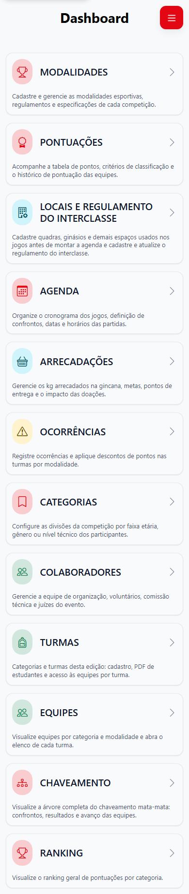

# 5. Jornada do aluno

## 1. Abrir o início

**Quem pode fazer:** aluno com senha obrigatória atualizada e termos aceitos.  
**Onde:** **Início**.

1. Entre no sistema com sua matrícula.
2. Confirme que o nome e a edição exibidos são os seus.
3. Leia avisos e use os atalhos para inscrições, jogos, perfil ou ranking quando disponíveis.

Se a edição não aparecer, confirme com a administração que você está vinculado à turma e à edição corretas.

## 2. Escolher modalidades

**Quem pode fazer:** aluno vinculado a uma turma elegível da edição, com termos aceitos e inscrições abertas.  
**Antes de começar:** consulte o cronograma publicado e saiba que a escolha é limitada a até três modalidades.

1. Abra **Inscrições**.
2. Confira as modalidades elegíveis para sua turma, categoria e gênero.
3. Leia os confrontos/horários previstos antes de escolher.
4. Selecione uma modalidade e a equipe correspondente, quando a tela pedir.
5. Repita a seleção até três modalidades no total, respeitando disponibilidade e compatibilidade de horários.
6. Confira o contador de modalidades, as equipes selecionadas e os avisos.
7. Selecione **Salvar inscrição** e aguarde a confirmação.

**Resultado esperado:** suas escolhas aparecem em **Suas inscrições** e contam no máximo três modalidades.

**O que o sistema pode recusar:** inscrições fora da janela, modalidade incompatível com a turma/categoria/gênero, equipe sem vaga, limite de modalidades excedido e conflitos de horário entre eventos/fases. Remova uma escolha incompatível na própria tela se essa ação estiver disponível; se não conseguir corrigir, peça ajuda à administração.

Não presuma que a inscrição pode ser cancelada ou alterada depois do prazo. Se selecionou a equipe errada, informe a administração antes do encerramento.

## 3. Consultar jogos e resultados

**Quem pode fazer:** aluno inscrito ou autorizado a consultar a edição.  
**Onde:** **Jogos**.

1. Abra **Jogos**.
2. Pesquise ou filtre a modalidade e a data, se os filtros estiverem disponíveis.
3. Abra o jogo para conferir horário, local, adversários e estado.
4. Depois da partida, retorne à tela para consultar o resultado publicado.

Os jogos podem estar previstos, pendentes ou concluídos. O cronograma publicado mostra o planejamento; um resultado só aparece depois de ser confirmado pela operação da partida.

## 4. Consultar a classificação

1. Abra **Ranking** ou o atalho disponível no início.
2. Selecione a edição e turma/modalidade, quando houver filtro.
3. Confira a posição e as informações mostradas.

O ranking pode depender da publicação pela administração e dos resultados já registrados. Se ainda não houver dados, isso não indica necessariamente erro na sua conta.

## 5. Consultar termos e atualizar o perfil

Use **Termos** para reler as condições da edição e **Perfil** para consultar/atualizar os campos disponíveis. Se o menu mostrar apenas **Termos**, finalize o aceite pendente antes de continuar.

*Figura 16. Em celulares, use o botão de menu para abrir as opções de navegação.*

**Próximo passo:** se uma escolha não for aceita, veja [problemas comuns](07-problemas-comuns.md).
