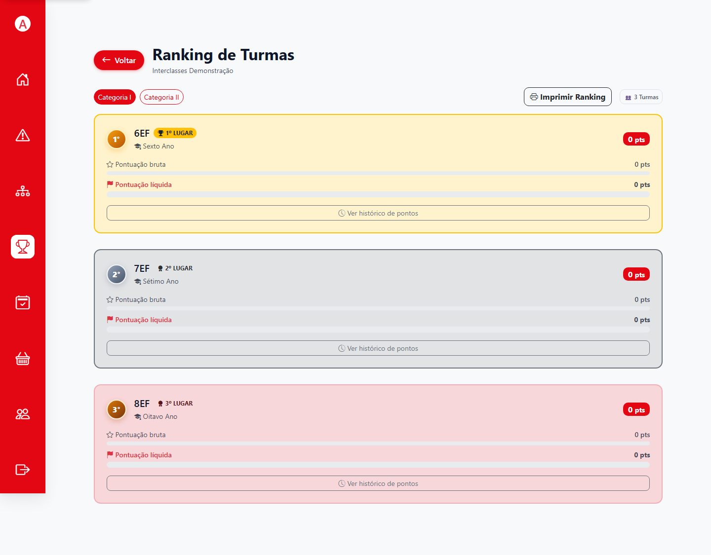
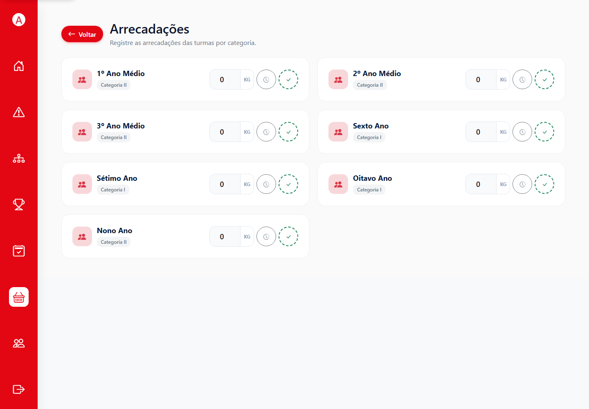
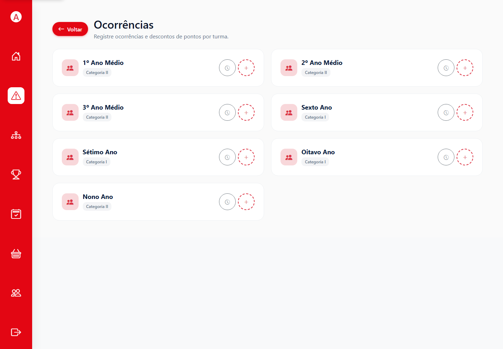
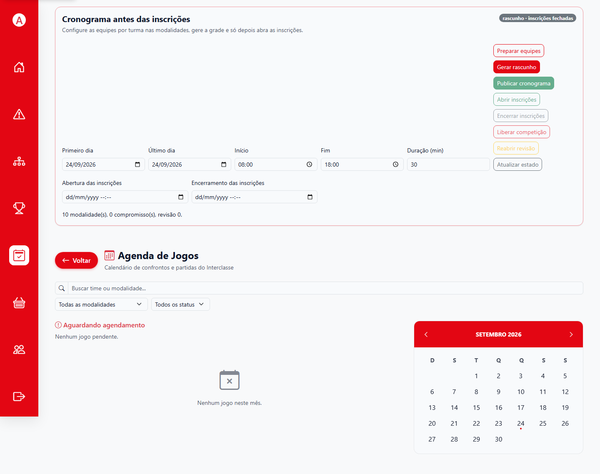

# 6. Resultados e consultas

## 1. Consultar o ranking

**Quem pode fazer:** administrador, colaborador, mesário ou aluno, conforme a publicação e o escopo da edição.  
**Onde:** **Ranking**; o aluno também pode ter **Ranking** no início.

1. Confira a edição selecionada.
2. Use os filtros de categoria, turma ou modalidade que estiverem disponíveis.
3. Confira colocação, pontos e destaques apresentados.
4. Para investigar uma posição, abra o histórico/detalhe da turma quando disponível e confira os resultados que contribuíram para a pontuação.

*Figura 17. Os valores zerados são do cenário de demonstração sem partidas concluídas.*

O ranking pode permanecer oculto até que a administração o publique. Status da edição e publicação do ranking são informações distintas. Se a página estiver vazia ou indisponível, confirme a edição e o estado de publicação com a administração.

## 2. Consultar arrecadações

**Quem pode fazer:** usuário administrativo autorizado.  
**Onde:** **Arrecadações** da edição.

1. Abra a edição correta e selecione **Arrecadações**.
2. Consulte os registros e os filtros disponíveis.
3. Para lançar ou ajustar um registro, use a ação apresentada pela tela, informe o tipo/unidade e quantidade exigidos e confira o efeito indicado antes de salvar.
4. Reabra a listagem para confirmar o registro.

Os valores e a conversão em pontos dependem da configuração da edição. Siga o regulamento aprovado; não use os valores da captura como regra geral.

*Figura 18. Consulte e registre apenas dados confirmados pela organização.*

## 3. Consultar ocorrências

1. Abra **Ocorrências**.
2. Filtre pela edição, turma ou estudante usando os controles existentes.
3. Confira tipo, descrição, data e penalidade.
4. Se identificar erro, siga a ação de edição/anulação disponível ou peça à administração para corrigir antes de usar o dado em uma apuração.

Uma penalidade é registrada como magnitude positiva; a regra de classificação aplica o desconto conforme configurado. Evite lançar uma segunda ocorrência para tentar cancelar a primeira.

*Figura 19. A lista permite localizar os registros disciplinares conforme o acesso da conta.*

## 4. Consultar jogos e chaveamento

- **Agenda:** horários e locais publicados, com filtros para localizar compromissos.
- **Jogos:** lista de partidas e acesso ao placar conforme seu perfil.
- **Chaveamento:** fases, participantes, partidas concluídas e próximos confrontos.

Use sempre a edição correta. A tela de chaveamento reflete a árvore publicada e os resultados confirmados; não é uma tela para gerar outra competição.

*Figura 20. A agenda diferencia o planejamento e os estados da competição.*

## 5. Encerrar e consultar uma edição

Quando uma edição não estiver ativa, seus registros podem continuar disponíveis para consulta conforme o acesso, a política de publicação e a navegação oferecida. Se não encontrar resultados, retorne a **Edições** (admin) ou confirme com a administração qual edição está selecionada. Não altere a edição ativa para “destravar” um histórico sem autorização.

**Próximo passo:** [resolver problemas comuns](07-problemas-comuns.md).
