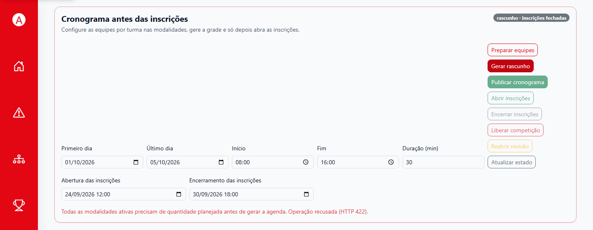

# 7. Problemas comuns

Use a mensagem da tela como ponto de partida. Confira edição, perfil e pré-requisitos antes de repetir uma ação que grava dados.

| O que aparece | O que conferir | Próxima ação segura |
| --- | --- | --- |
| Acesso negado ou ação indisponível | Perfil da conta, sessão atual e edição do recurso | Saia e entre novamente; peça ao administrador para conferir permissão e edição. |
| O aluno volta para Trocar senha ou Termos | Etapa obrigatória ainda pendente | Conclua a troca/aceite e entre novamente em Inscrições. |
| Não há edição ativa para inscrições | Estado da edição ou vínculo do aluno | Confirme com a administração que a edição está ativa e o aluno pertence à turma correta. |
| A lista de modalidades não carrega | Conexão, sessão e disponibilidade da edição | Use **Tentar novamente** se aparecer; não repita uma inscrição já confirmada. |
| A agenda diz que falta quantidade planejada | Modalidade ativa sem equipes/entradas previstas | Confira o campo de planejamento na modalidade. Não exclua cadastros existentes para contornar. |
| O rascunho tem pendências ou não gera | Período, locais, modalidade ativa e quantidades planejadas | Corrija os cadastros indicados e gere uma nova prévia antes de publicar. |
| O compromisso aparece em outro mês ou a agenda parece vazia | Mês selecionado e datas do cronograma | Navegue até o mês do evento e confira filtros de modalidade/status. |
| A inscrição foi recusada | Janela, vaga, elegibilidade e conflitos de horário | Leia o aviso; ajuste a escolha na tela se possível ou peça ajuda à administração. |
| A competição não libera | Inscrições abertas ou elenco abaixo do mínimo | Encerre inscrições, confira os membros de cada equipe e complete o mínimo configurado. |
| Não encontro uma partida no placar | Edição, liberação, fase e disponibilidade do jogo | Volte à Agenda/Chaveamento e confirme a partida correta antes de operar. |
| O placar ou uma ocorrência ficou diferente do esperado | Equipe/aluno selecionado e Timeline do jogo | Não lance uma ação inversa às cegas; use a correção/anulação disponível e confira o histórico. |
| O ranking está vazio ou não aparece | Edição, resultados confirmados e publicação do ranking | Confirme os dados com a administração; não confunda edição ativa com ranking publicado. |
| A foto não é aceita | Formato ou tamanho do arquivo | Use JPG, PNG, GIF ou WebP até 5 MB. |
| O aluno não aparece após importar um PDF | PDF em imagem, arquivo acima de 10 MB ou turma errada | Confirme o texto selecionável e a turma; pesquise antes de repetir a importação. |
| A conexão caiu durante o placar | Aba preparada e estado da fila de sincronização | Mantenha a mesma aba aberta, reconecte e aguarde confirmação. Não atualize, feche ou limpe os dados. |
| Há uma operação pendente/recusada | Aviso de sincronização, jogo e rede disponível | Registre horário e jogo e peça suporte. Só considere finalizado após a confirmação e consulta online do resultado. |

## Bloqueio na geração do rascunho

Na edição demonstrativa, a tentativa de gerar a grade sem as quantidades planejadas foi recusada com o aviso “Todas as modalidades ativas precisam de quantidade planejada antes de gerar a agenda.”

*Figura 21. Corrija as modalidades ativas antes de gerar ou publicar a agenda.*

## Uma inscrição ou ponto parece ter sido enviado duas vezes

1. Pare antes de clicar novamente.
2. Reabra a lista, o detalhe ou a Timeline para verificar se o primeiro envio já foi registrado.
3. Se estiver sem rede, não abra outra aba para repetir. Mantenha a aba original e espere a resposta da sincronização.
4. Se ainda houver dúvida, anote o usuário, a edição, o jogo/ação e o horário aproximado e peça suporte.

## Informações para pedir suporte

Informe perfil, edição/ano, tela, passo executado, resultado esperado, mensagem observada e horário aproximado. Em operação offline, diga se a aba original permanece aberta e se o status está pendente ou recusado. Não envie senha, tokens, cookies ou dados pessoais desnecessários.

**Voltar ao índice:** [Manual do usuário do SGI](README.md).
